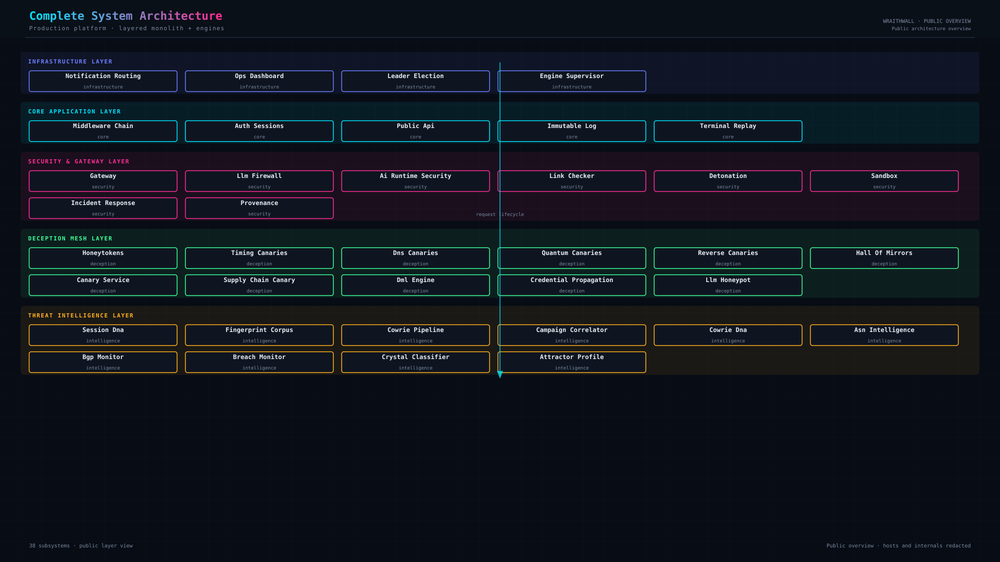
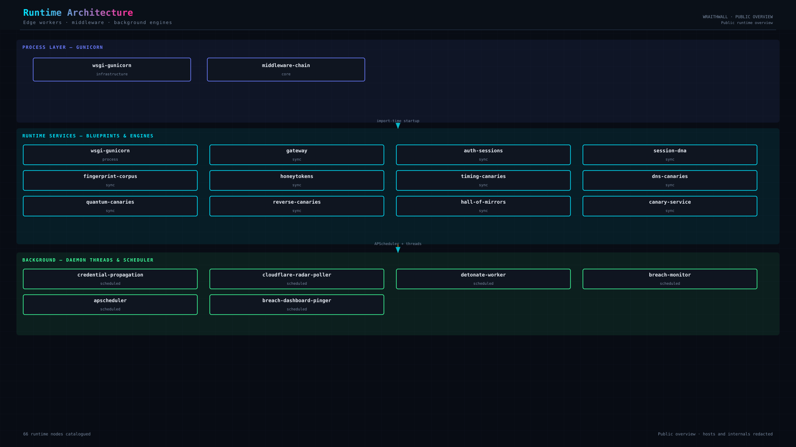

# Architecture overview

WraithWall is a Flask monolith with deception and intelligence engines. This page indexes validated documentation — not a substitute for the Phase 8 corpus.

**Last updated:** Phase 3 intelligence layer (2026-07-16)

## Start here

| Resource | Description |
| -------- | ----------- |
| [wraithwall.online/docs](https://wraithwall.online/docs) | Public documentation hub |
| [LAUNCH.md](../LAUNCH.md) | Plain-language field guide to production behaviour |
| [Public redacted blueprints (below)](#public-vs-operator-diagrams) | Four public overviews embedded on this page |
| [CLAUDE.md](../CLAUDE.md) | Commands, blueprints, env vars |

## Public vs operator diagrams

| Set | Count | Access | Path |
| --- | ----- | ------ | ---- |
| Public redacted | 4 | Unauthenticated landing gallery | `static/img/architecture/public/` |
| Full corpus | 15 | Login — `/console#/architecture` | `static/img/architecture/` |

Public IDs: `01-complete-system-architecture`, `02-runtime-architecture`, `07-threat-intelligence-pipeline`, `11-notification-pipeline`.

Manifest: [`static/img/architecture/manifest.json`](../static/img/architecture/manifest.json)

**Embedded public architecture overview (Phase 9 refreshed):**





## Validated corpus (Phase 8)

Machine-readable architecture artifacts live in [`docs/architecture/`](architecture/):

- `architecture.json` — 34 subsystems
- `dependency_graph.json`, `runtime_graph.json`, `event_graph.json`
- `redis_graph.json`, `scheduler_graph.json`, `notification_graph.json`
- `trust_boundaries.json`, `live_nodes.json`, `live_edges.json`

Authenticated operators can explore interactive views at `/console#/architecture` via `architecture_viz.py` (graph query API over the allowlisted corpus).

## Diagrams in this repo

| File | Topic |
| ---- | ----- |
| [diagrams/campaign-correlation.svg](diagrams/campaign-correlation.svg) | Campaign correlation |
| [diagrams/honeypot-mitre-pipeline.svg](diagrams/honeypot-mitre-pipeline.svg) | Honeypot → MITRE pipeline |

Regenerate Phase 8 publication SVGs/PNGs:

```bash
python3 scripts/generate_wraithwall_diagrams.py
```

## Phase 3 — Intelligence & adversary analysis

Production intelligence core (not chatbot AI):

| Component | Module | Role |
| --------- | ------ | ---- |
| Multi-signal campaigns | `campaign_correlator.py` + `intelligence_layer.py` | Evolving campaign graphs + evidence trails |
| Attacker memory | `behavioral_dna.py` + `AttackerMemory` | 90-day durable profiles |
| Threat reasoning | `ThreatReasoner` | Evidence-backed conclusions + uncertainty |
| Adaptive risk | `unison_score.py` + `compute_adaptive_risk` | Memory/campaign/MITRE-aware scoring |
| Intelligence graph | `IntelligenceGraph` | Attacker→infra→session→technique→campaign |
| Prediction | `predict_attacker` | Next stage / return / escalation (confidence required) |
| Async enrichment | `start_intelligence_worker` | Non-blocking queue from Cowrie close path |

Details: [docs/intelligence.md](intelligence.md).

## Runtime visualization

| Surface | Data source | Auth |
| ------- | ----------- | ---- |
| Landing HeroTerminal + charts | `/api/public/stats` | Public |
| Attack feed / sensor radar | Redis-backed public stats | Public |
| Console architecture graphs | `architecture_viz` + corpus JSON | Login required |
| Intelligence graph API | `/api/intelligence/graph/*` | Login / API key |
| Ops dashboard (separate service) | `ops-dashboard/` | Independent deploy |

## Audit documents (operator use)

`SECURITY_AUDIT.md`, `THREAT_MODEL.md`, `DEPENDENCY_AUDIT.md`, and `COWRIE_AUDIT.md` exist at the repository root for internal review. They are **not** linked from the public README until a sensitivity review confirms safe public indexing.

## Historical note

Phase 8 corpus validation preceded Phase 9 website integration. Earlier README text referenced a "follow-on diagram pass" for deployment topology — those views are now included in the 15-diagram operator set (e.g. `10-trust-boundary-map`, `05-cowrie-deception-pipeline`) while the public landing intentionally shows only four redacted overviews.