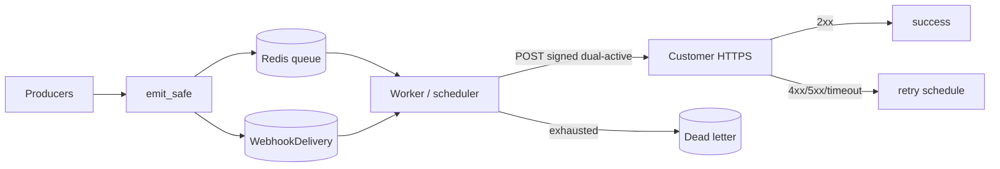

# WraithWall Webhook Platform Architecture

**Status:** Platform **v2.0.0** (shipping)  
**API version:** `2026-07-15`  
**Module:** `webhooks.py` · models in `main.py` · dashboard `/webhooks`  
**OpenAPI:** `GET /api/webhooks/openapi.json`

## Goals

Stripe/GitHub-class outbound webhooks: signed payloads, async delivery, retries, DLQ, owner-scoped endpoints, developer dashboard.

## Event lifecycle

```
Producer (canary, BGP, scan, …)
  → emit_safe(type, data, user_id?)
  → enqueue_webhook_event
      · match enabled endpoints (subscription filter)
      · create WebhookDelivery (status=pending)
      · payload { id, type, created, data, api_version, livemode }
  → Redis LPUSH delivery_queue  OR  daemon thread
  → Worker / scheduler process_webhook_retries
      · RPOP queue → HTTP POST receiver
      · success → status=success, success_count++
      · failure → backoff schedule (pending + next_retry_at)
      · exhausted → status=dead + Redis DLQ
```

## Queueing

| Layer | Mechanism |
|-------|-----------|
| Primary | Redis list `wraithwall:webhooks:delivery_queue` |
| Fallback | `threading.Thread` daemon if Redis unavailable |
| Drain | APScheduler job every 1 minute + due-retry scan |
| DLQ | Redis list `wraithwall:webhooks:dead_letter` (cap 1000) |

**Delivery guarantee:** at-least-once. Receivers must treat `id` / `X-WraithWall-Idempotency-Key` as idempotent.

## Retry strategy

| Attempt | Delay before next |
|---------|-------------------|
| 1 | immediate (queue) |
| 2 | 30s |
| 3 | 2m |
| 4 | 10m |
| 5 | 1h |
| >5 | **dead** (no further auto retry) |

- Timeout per attempt: **10s**
- Redirects: not followed
- Manual **replay** via API/dashboard forces another attempt (capped)

## Signature verification

```
signed_payload = f"{timestamp}.{raw_body}"
v1 = HMAC_SHA256(secret, signed_payload)  # hex
header = f"t={timestamp},v1={v1}"
```

Headers on each delivery:

- `X-WraithWall-Signature` / `WraithWall-Signature`
- `X-WraithWall-Event`, `X-WraithWall-Delivery`
- `X-WraithWall-Event-Id`, `X-WraithWall-Idempotency-Key` (same as event `id`)
- `X-WraithWall-API-Version`

**Replay protection (receiver-side):** reject if `|now - t| > 300` seconds.

## Secret rotation (v2 dual-active)

`POST /api/webhooks/endpoints/<id>/rotate-secret`

1. Current secret moves to `secret_enc_prev`
2. `secret_prev_expires` = now + **24 hours**
3. New `whsec_…` returned once

Outbound deliveries during grace sign with **both** secrets:

```
X-WraithWall-Signature: t=<ts>,v1=<new>,v1=<old>
X-WraithWall-Signature-Mode: dual-active
```

Receivers verifying with either secret succeed until grace ends.

## Idempotency

- Event `id` (`evt_…`) unique per delivery fan-out item  
- Receiver should key off event id (or delivery id for per-attempt audits)  
- Replays reuse the same payload/event id

## Failure handling & DLQ

| Status | Meaning |
|--------|---------|
| `pending` | Queued or awaiting retry |
| `success` | 2xx from receiver |
| `failed` | legacy terminal fail (mapped toward dead) |
| `dead` | Exhausted retries or endpoint gone |

## Rate limiting

Flask-Limiter on create/test/list routes. Endpoint count cap: **20 per user**.

## Event versioning

- Payload field `api_version` (`2026-07-15`)
- Header `X-WraithWall-API-Version`
- Breaking changes → new version string; keep old event types stable

## Security notes

- SSRF: block link-local / metadata hosts; https required (http only localhost)
- Origin gate applies to state-changing `/api/webhooks/*` for browsers
- Secrets stored server-side for signing (`secret_enc`); hash for audit
- Prefer KMS envelope encryption for `secret_enc` in v2

## Local testing (v2 foundation)

```bash
# Terminal A — receiver with live verify
python3 scripts/wraithwall_webhooks.py listen --port 8787 --secret whsec_…

# Terminal B — public URL
cloudflared tunnel --url http://127.0.0.1:8787

# Dashboard /webhooks → create endpoint → Send test
python3 scripts/wraithwall_webhooks.py tunnel-hint
python3 scripts/wraithwall_webhooks.py catalog --local
```

## Producers (wired)

| Event | Module |
|-------|--------|
| `canary.triggered` | `canary_service.py` |
| `deception.event` | `deception_event_bus.py` |
| `cowrie.session.opened` / `closed` | `cowrie_intelligence.py` |
| `scan.completed` | `link_checker.py` |
| `detonation.completed` | `detonate.py` (sync + async) |
| `llm_firewall.alert` | `llm_firewall.py` (block) |
| `bgp.alert` | `bgp_monitor.py` |
| `supply_chain.beacon` | `supply_chain_canary.py` |
| `api_key.created` / `revoked` | `main.py` |
| `webhook.test` | API / dashboard |

## Diagram (Mermaid)



## v2.0 shipped

| Feature | Detail |
|---------|--------|
| At-rest secrets | `enc:v1:` Fernet (key from `WEBHOOK_SECRET_KEY` or `SECRET_KEY`) |
| Dual-active rotation | 24h previous secret + dual `v1=` signatures |
| Event JSON Schema | `GET /api/webhooks/events/<type>/schema` |
| OpenAPI | `GET /api/webhooks/openapi.json` |
| Campaign / incident | `campaign.created`, `campaign.updated`, `incident.created` |
| CLI | `listen`, `register`, `schema`, `openapi`, `tunnel-hint` |

## Remaining (v2.x / v3)

- External KMS (AWS/GCP/Vault) instead of app-derived Fernet
- Auto-tunnel CLI that creates + tears down temporary endpoints
- Multi-region delivery workers
- DNA anomaly / IOC events when those pipelines emit stable public events
